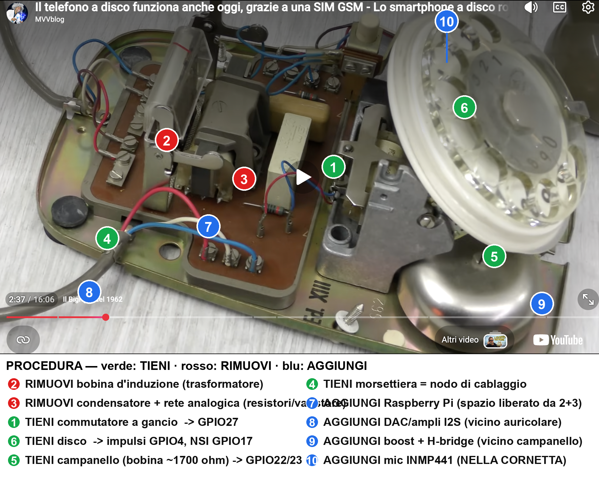

# 07 — Mappa di conversione della cassetta

Da consultare **dopo** l'apertura del telefono (Step 1–2 di
[`04_installation.md`](04_installation.md)) e **prima** di rimuovere qualcosa:
cosa togliere, cosa tenere e dove sistemare i componenti nuovi.

Vista più chiara (stesso modello, angolazione diversa) con gli stessi numeri:

> 🟩 verde = tenere · 🟥 rosso = rimuovere · 🟦 blu = nuovo.
> Le posizioni dei marker sono **indicative**: verifica sempre sul tuo esemplare.

Versione **schematica** pulita (stessa numerazione 1–10), comoda come riferimento
rapido: [`../assets/diagrams/09_conversion_map.svg`](../assets/diagrams/09_conversion_map.svg).

## In breve

| Azione | Componenti | Note |
|--------|-----------|------|
| **Tieni** | Disco combinatore, commutatore a gancio, campanello (campane + bobina), morsettiera, altoparlante cornetta | Da ricablare verso l'ESP32 (vedi [`03_wiring.md`](03_wiring.md)) |
| **Rimuovi** | Bobina d'induzione (trasformatore), condensatore + rete analogica (resistori/varistore) | Era il circuito fonia analogico, ora sostituito da ESP32 + I2S |
| **Aggiungi** | ESP32-DevKitC-VE su basetta a morsetti, codec WM8960, boost + H-bridge campanello, capsula electret (in cornetta) | La basetta a morsetti va nello spazio centrale liberato |

## Mappatura completa

Tabelle dettagliate (terminali dello schema S62, valori, GPIO) e identificazione
dei contatti col multimetro: vedi [`../hardware/retrofit_layout.md`](../hardware/retrofit_layout.md).

| # | Tieni / Rimuovi / Aggiungi | Componente | GPIO |
|---|----------------------------|-----------|------|
| 1 | Tieni | Commutatore a gancio | GPIO 18 |
| 6 | Tieni | Disco combinatore (impulsi + NSI) | GPIO 4 / GPIO 32 |
| 5 | Tieni | Campanello (bobina ≈ 1700 Ω) | GPIO 13 / GPIO 14 |
| 4 | Tieni | Morsettiera (nodo di cablaggio) | — |
| 2 | Rimuovi | Bobina d'induzione / trasformatore | — |
| 3 | Rimuovi | Condensatore + rete analogica | — |
| 7 | Aggiungi | ESP32 su basetta a morsetti (zona centrale) | — |
| 8 | Aggiungi | Codec WM8960 (nella base) | I2S + I2C |
| 9 | Aggiungi | Boost + H-bridge (vicino campanello) | — |
| 10 | Aggiungi | Capsula electret (nella cornetta) | analogico — 3 fili sul cordone |

## Procedura consigliata (l'ordine conta)

Idea di fondo: **prima svuoti** la fascia centrale (parti analogiche), **poi
popoli** lo spazio con l'ESP32, cablando e collaudando **un sottosistema alla volta**.
I numeri rimandano ai marker dell'immagine; gli Step a [`04_installation.md`](04_installation.md).

### Fase A — Smontaggio (sicuro, reversibile)

0. **Fotografa ed etichetta** tutti i fili prima di staccare (04 · Step 1–2).
1. Assicurati che il telefono **non sia collegato alla linea**; nessuna tensione presente.
2. Rimuovi **③ condensatore + rete analogica** (resistori/varistore): annota i fili, poi dissalda/scollega.
3. Rimuovi **② bobina d'induzione (trasformatore)**.
4. Scollega il **⑤ campanello dalla linea** (lascia bobina e campane in sede): i due capi della bobina andranno all'H-bridge.
5. **Isola i contatti** di **① gancio** e **⑥ disco** che userai; scollega il resto dal circuito originale.

➡️ Risultato: nello chassis restano solo **disco, gancio, campanello, morsettiera**; la fascia centrale è libera.

### Fase B — Montaggio (un blocco alla volta, con collaudo)

| Ordine | Monta | Cabla | Verifica |
|--------|-------|-------|----------|
| 1 | **⑦ ESP32 su basetta a morsetti** nello spazio centrale | alimentazione 5V | `idf.py monitor` mostra il boot |
| 2 | segnali a bassa tensione | ① gancio→GPIO18, ⑥ impulsi→GPIO4, NSI→GPIO32 — **direttamente sui morsetti**, senza optoaccoppiatori né rete RC | bring-up: gancio a log e ogni cifra 0-9 corretta (10 impulsi → `0`) |
| 3 | **⑩ capsula electret** in cornetta + **⑧ codec WM8960** nella base | 3 fili del cordone: massa, mic, ascolto | test audio loopback: si parla e ci si sente |
| 4 | **⑨ boost + H-bridge** | bobina **⑤ campanello** | test campanello (3 squilli, 1 s on / 4 s off) |
| 5 | alimentazione (rete + tampone) + display/WS2812 | — | LED stato, OLED |
| 6 | — | — | **bring-up completa**, tutti i sottosistemi in sequenza |
| 7 | chiusura | fascette; verifica che i cavi non tocchino il martelletto | il disco gira libero |

> Collauda **prima** di richiudere il coperchio (04 · Step 10): rilavorare a cassetta aperta costa molto meno.

## Materiale di riferimento

- Schema originale Siemens S62: [`../assets/retrofit/s62_schema.jpg`](../assets/retrofit/s62_schema.jpg)
- Foto cassetta smontata: [`../assets/retrofit/cassetta_smontata.jpg`](../assets/retrofit/cassetta_smontata.jpg)
- Mappa tecnica completa: [`../hardware/retrofit_layout.md`](../hardware/retrofit_layout.md)
